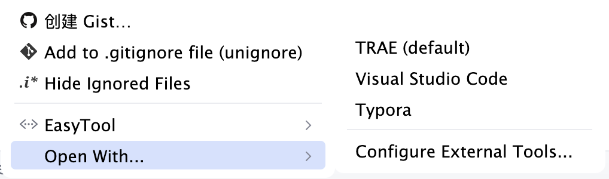
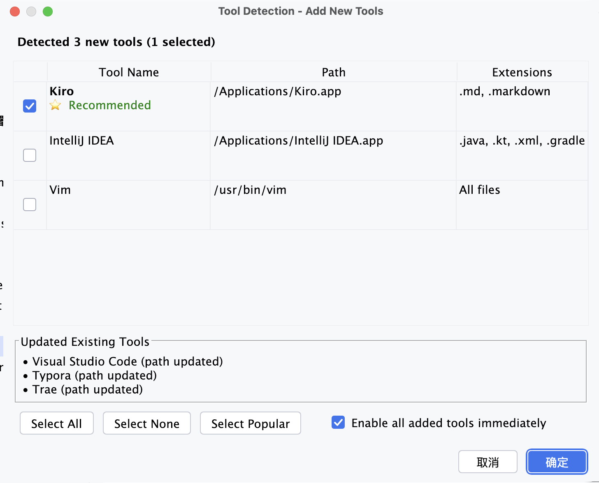
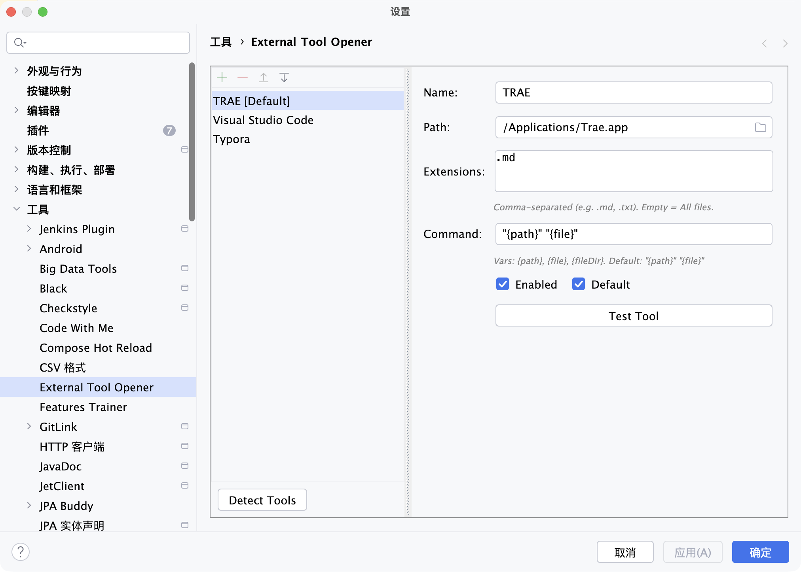

# External Tool Opener - 外部工具打开器

[](https://github.com/Lemon695/external-tool-opener)
[](LICENSE)
[](https://plugins.jetbrains.com/)

一个强大的 IntelliJ 平台插件，允许你直接从 IDE 上下文菜单用外部应用程序打开文件。

[English Documentation](README.md)

## ✨ 功能特性

- **🎯 智能右键菜单** - 右键点击任何文件即可用配置的外部工具打开
- **🔍 自动检测** - 自动检测系统中已安装的应用程序
- **⚡ 智能预选** - 根据优先级自动预选常用工具
- **🎨 灵活配置** - 配置无限数量的外部应用程序
- **📁 文件类型关联** - 将特定文件扩展名链接到首选工具
- **🌍 跨平台** - 支持 Windows、macOS 和 Linux
- **🔄 智能合并** - 检测新工具时保留你的设置

## 🚀 快速开始

### 安装

1. 从 [Releases](https://github.com/Lemon695/external-tool-opener/releases) 下载最新版本
2. 打开 IDE：**设置** → **插件** → **⚙️** → **从磁盘安装插件**
3. 选择下载的 `.zip` 文件
4. 重启 IDE

### 首次使用

1. **自动检测工具**：
   - 进入 **设置** → **工具** → **External Tool Opener**
   - 点击 **"Detect Tools"** 按钮
   - 查看检测到的工具并启用你需要的

2. **手动配置**：
   - 点击 **"+"** 添加新工具
   - 设置名称、可执行文件路径和支持的扩展名
   - 点击 **确定** 保存

3. **使用**：
   - 在项目视图或编辑器中右键点击任何文件
   - 选择 **"Open With..."**
   - 选择你的外部工具

## 📋 支持的 IDE

兼容**所有 JetBrains IDE**（2020.1+）：

- ✅ IntelliJ IDEA
- ✅ PyCharm
- ✅ WebStorm
- ✅ PhpStorm
- ✅ GoLand
- ✅ RubyMine
- ✅ CLion
- ✅ Android Studio
- ✅ Rider
- ✅ DataGrip

## 🛠️ 预配置工具

插件包含 10 个流行工具的检测：

| 工具 | 类别 | 优先级 | 平台 |
|------|------|--------|------|
| Visual Studio Code | 编辑器 | ⭐⭐⭐ | Win/Mac/Linux |
| Sublime Text | 编辑器 | ⭐⭐ | Win/Mac/Linux |
| Typora | Markdown | ⭐⭐⭐ | Win/Mac/Linux |
| Trae | Markdown | ⭐⭐⭐ | Mac |
| Kiro | Markdown | ⭐⭐⭐ | Mac |
| IntelliJ IDEA | IDE | ⭐⭐ | Win/Mac/Linux |
| Notepad++ | 编辑器 | ⭐ | Windows |
| Atom | 编辑器 | ⭐ | Win/Mac/Linux |
| Vim/MacVim | 编辑器 | ⭐ | Mac/Linux |

## 🎨 截图

### 右键菜单



### 自动检测对话框


### 设置面板


## 🔧 配置说明

### 工具属性

- **名称**：菜单中显示的名称
- **可执行文件路径**：应用程序的完整路径
- **支持的扩展名**：文件类型（例如 `.md`、`.js`）
- **启用**：切换工具可见性
- **优先级**：用于智能预选（1-10）

### 智能检测

自动检测系统：
1. 扫描常见安装路径
2. 验证工具可访问性
3. 预选优先级 ≥ 8 的工具
4. 与现有配置合并
5. 新工具默认禁用

### 路径模板

支持动态路径展开：
- `{user}` - 当前用户名
- `{home}` - 用户主目录

示例：`C:\Users\{user}\AppData\Local\Programs\...`

## 📖 使用示例

### 用 Typora 打开 Markdown 文件

1. 配置 Typora：
   - 路径：`/Applications/Typora.app`（Mac）
   - 扩展名：`.md`、`.markdown`
   - 启用：✓

2. 右键点击任何 `.md` 文件 → **Open With...** → **Typora**

### 用 VS Code 打开代码

1. 自动检测或手动添加 VS Code
2. 右键点击项目文件 → **Open With...** → **Visual Studio Code**

## 🤝 贡献

欢迎贡献！请随时提交 Pull Request。

### 开发环境设置

```bash
# 克隆仓库
git clone https://github.com/Lemon695/external-tool-opener.git
cd external-tool-opener

# 构建插件
./gradlew buildPlugin

# 在 IDE 中运行
./gradlew runIde
```

### 项目结构

```
external-tool-opener-plugin/
├── src/main/
│   ├── java/com/lemon/externaltool/
│   │   ├── action/          # 上下文菜单操作
│   │   ├── config/          # 设置界面
│   │   ├── model/           # 数据模型
│   │   ├── service/         # 核心服务
│   │   └── ui/              # UI 组件
│   └── resources/
│       ├── META-INF/
│       │   └── plugin.xml   # 插件配置
│       └── tool-registry.yaml  # 工具定义
├── build.gradle.kts         # 构建配置
└── README_CN.md
```

## 📝 更新日志

### 版本 1.1.3（2026-01-04）

- ✨ 添加智能工具选择对话框
- ✨ 实现 10 个流行工具的自动检测
- ✨ 添加 Trae 和 Kiro 支持
- 🔧 优化菜单位置（在 "Reveal In" 之后）
- 🔧 扩展 IDE 兼容性至 2020.1+
- 🐛 修复与 PyCharm 2025.3 的兼容性问题

### 版本 1.0.0

- 🎉 初始版本
- ✨ 基本外部工具配置
- ✨ 上下文菜单集成
- ✨ 文件类型关联

## 📄 许可证

本项目采用 MIT 许可证 - 详见 [LICENSE](LICENSE) 文件。

## 🙏 致谢

- 感谢所有贡献者
- 受更好的外部工具集成需求启发
- 使用 [IntelliJ Platform SDK](https://plugins.jetbrains.com/docs/intellij/) 构建

## 📞 支持

- 🐛 [报告问题](https://github.com/Lemon695/external-tool-opener/issues)
- 💡 [功能请求](https://github.com/Lemon695/external-tool-opener/issues/new)
- 📧 邮箱：-

## ⭐ Star 历史

如果你觉得这个插件有用，请考虑给它一个 star！

---

用 ❤️ 制作，作者 [Lemon695](https://github.com/Lemon695)
